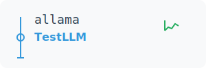

# Allama - LLM Testing and Benchmarking Suite 🧪

A comprehensive testing and benchmarking suite for Large Language Models (LLMs) focused on Python code generation. The project enables automatic quality assessment of generated code through various metrics and generates detailed HTML reports.

## ✨ Features

- **Automated Testing** of multiple LLM models with configurable prompts
- **Code Quality Assessment** - syntax checking, execution, style, and functionality
- **Detailed HTML Reports** with metrics, charts, and comparisons
- **Results Export** to CSV and JSON for further analysis
- **Highly Configurable** - easily add new models and tests
- **Multiple API Support** - Ollama, local servers, cloud services
- **Model Ranking** based on performance and quality metrics

## 🚀 Quick Start

### 1. Installation

#### Using Poetry (recommended)
```bash
# Clone the repository
git clone https://github.com/wronai/allama.git
cd allama

# Install dependencies
pip install poetry
poetry install

# Activate the virtual environment
poetry shell
```

#### Using pip
```bash
pip install .
```

### 2. Model Configuration

Create or edit the `models.csv` file to configure your models:

```csv
model_name,url,auth_header,auth_value,think,description
mistral:latest,http://localhost:11434/api/chat,,,false,Mistral Latest on Ollama
llama3:8b,http://localhost:11434/api/chat,,,false,Llama 3 8B
gpt-4,https://api.openai.com/v1/chat/completions,Authorization,Bearer sk-...,false,OpenAI GPT-4
```

**CSV Columns:**
- `model_name` - Name of the model (e.g., mistral:latest, gpt-4)
- `url` - API endpoint URL
- `auth_header` - Authorization header (if required, e.g., "Authorization")
- `auth_value` - Authorization value (e.g., "Bearer your-api-key")
- `think` - Whether the model supports "think" parameter (true/false)
- `description` - Description of the model

### 3. Running Tests

#### Basic Usage
```bash
# Run all tests with default configuration
python -m allama.main

# Run benchmark suite
python -m allama.main --benchmark

# Test specific models
python -m allama.main --models "mistral:latest,llama3.2:3b,gemma2:2b"

# Test a single model
python -m allama.main --single-model "mistral:latest"

# Compare specific models
python -m allama.main --compare "mistral:latest" "llama3.2:3b"

# Generate HTML report
python -m allama.main --output benchmark_report.html

# Run with verbose output
python -m allama.main --verbose
```

## 🛠️ Usage Examples

### Using Makefile (recommended)
```bash
# Install dependencies and setup
make install

# Run tests
make test

# Run all tests including end-to-end
make test-all

# Run benchmark suite
make benchmark

# Test a single model (set MODEL=name)
make single-model

# Generate HTML report
make report

# Run code formatters
make format

# Run linters
make lint
```

### Advanced Usage
```bash
# Run with custom configuration
python -m allama.runner --config custom_config.json

# Test with a specific prompt
python -m allama.runner --single-model "mistral:latest" --prompt-index 0

# Set request timeout (in seconds)
python -m allama.runner --timeout 60
```

## 📊 Evaluation Metrics

The system evaluates generated code based on the following criteria:

### Basic Metrics (automatic)
- ✅ **Correct Syntax** - whether the code compiles without errors
- ✅ **Executability** - whether the code runs without runtime errors
- ✅ **Keyword Matching** - whether the code contains expected elements from the prompt

### Code Quality Metrics
- 📝 **Function/Class Definitions** - proper code structure
- 🛡️ **Error Handling** - try/except blocks, input validation
- 📚 **Documentation** - docstrings, comments
- 📦 **Imports** - proper library usage
- 📏 **Code Length** - reasonable number of lines

### Scoring System
- Correct Syntax: **3 points**
- Runs without errors: **2 points**
- Contains expected elements: **2 points**
- Has function/class definitions: **1 point**
- Has error handling: **1 point**
- Has documentation: **1 point**
- **Maximum: 10 points**

## 🔧 Configuration

### Customizing Prompts

Edit the `allama/config.py` file to modify test prompts:

```python
TEST_PROMPTS = [
    {
        "name": "Custom Function",
        "prompt": "Write a Python function that...",
        "expected_keywords": ["def", "function_name"],
        "expected_behavior": "function_definition"
    }
]
```

### JSON Configuration

Create a `custom_config.json` file for advanced configuration:

```json
{
    "test_prompts": [
        {
            "name": "Custom Test",
            "prompt": "Your custom prompt here..."
        }
    ],
    "timeouts": {
        "request_timeout": 30,
        "execution_timeout": 5
    }
}
```

## 🔌 API Integration Examples

### Ollama (local)
```csv
llama3:8b,http://localhost:11434/api/chat,,,false,Llama 3 8B
```

### OpenAI API
```csv
gpt-4,https://api.openai.com/v1/chat/completions,Authorization,Bearer sk-your-key,false,OpenAI GPT-4
```

### Anthropic Claude
```csv
claude-3,https://api.anthropic.com/v1/messages,x-api-key,your-key,false,Claude 3
```

### Local Server
```csv
local-model,http://localhost:8080/generate,,,false,Local Model
```

## 📁 Project Structure

```
allama/
├── allama/               # Main package
│   ├── __init__.py      # Package initialization
│   ├── config.py        # Default configuration and prompts
│   ├── main.py          # Main module
│   └── runner.py        # Test runner implementation
├── tests/               # Test files
│   └── test_allama.py   # Unit tests
├── models.csv           # Model configurations
├── pyproject.toml       # Project metadata and dependencies
├── Makefile             # Common tasks
└── README.md            # This file
```

## 📈 Example Output

After running the benchmark, you'll get:

1. **Console Output**: Summary of test results
2. **HTML Report**: Detailed report with code examples and metrics
3. **CSV/JSON**: Raw data for further analysis

## 🚀 Getting Help

If you encounter any issues or have questions:

1. Check the [issues](https://github.com/wronai/allama/issues) page
2. Create a new issue with detailed information about your problem

## 🤝 Contributing

Contributions are welcome! Please read our [Contributing Guidelines](CONTRIBUTING.md) for details on how to contribute to this project.

## 📄 License

This project is licensed under the MIT License - see the [LICENSE](LICENSE) file for details.

## 🙏 Acknowledgments

- Thanks to all the open-source projects that made this possible
- Special thanks to the Ollama team for their amazing work

---

<div align="center">
  Made with ❤️ by the Allama team
</div>